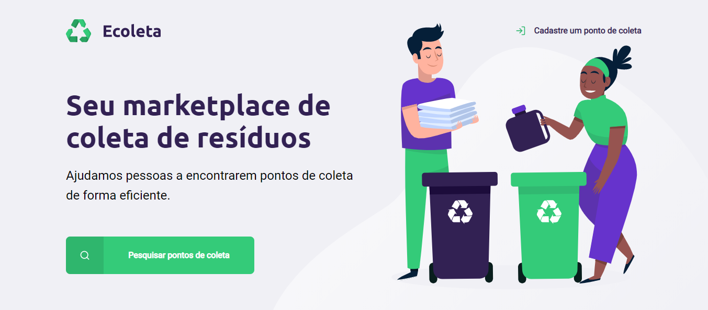
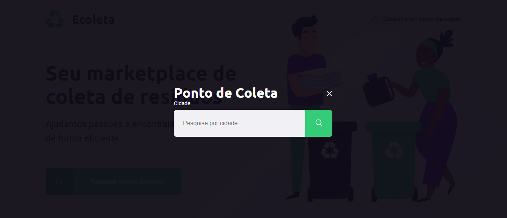
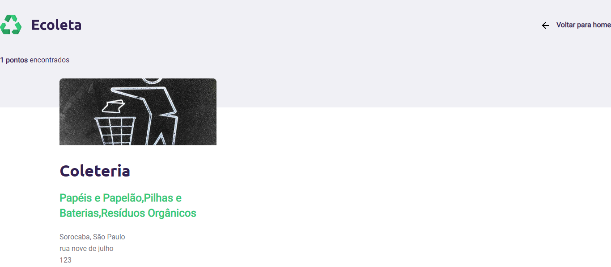
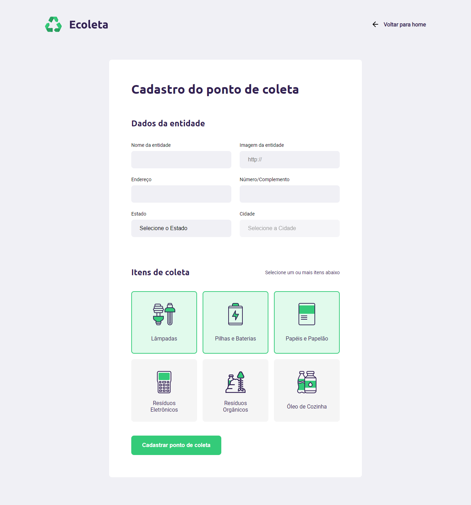
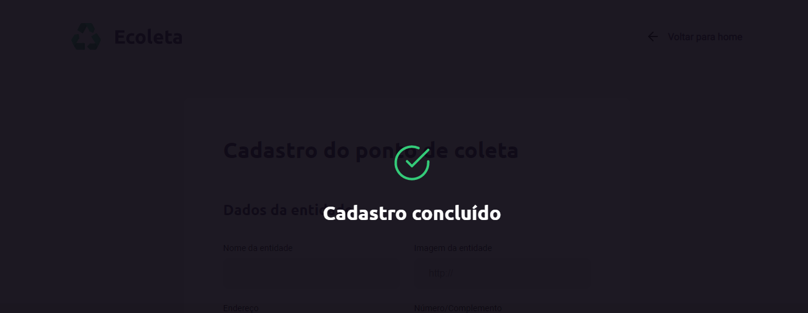

# 

## 💻 Sobre o projeto

O projeto Ecoleta trata-se de uma **aplicação web** destinada a conectar pessoas com entidades que tratam **lixo reciclável** de diversas categorias. A ideia de criar uma aplicação voltada ao meio ambiente surgiu da coincidência da data do curso (na trilha **Starter** da *Next Level Week* distribuída pela **Rocketseat**.) e a data da **semana do meio ambiente.**.

## :rocket:  Tecnologias utilizadas
Esse projeto foi desenvolvido com as seguintes tecnologias:
- [Html5](https://html.spec.whatwg.org/)
- [Css3](https://www.w3schools.com/Css/)
- [JavaScript](https://www.w3.org/standards/webdesign/script)
- [NodeJS]()
- [SQLite3](https://www.sqlite.org/index.html)
- [Nunjucks](https://mozilla.github.io/nunjucks/)

## :zap:  Melhorias extras
- Adicionado na página de buscas *"Estado"* e *"Cidades"*, com lista recuperada através da API do IBGE.
- Responsivo.

## :white_check_mark: Resultado
 *Página Inicial*

 *Modal de pesquisa*

 *Página resultado da pesquisa*
 
 *Página cadastro ponto de coleta*

 *Modal cadastro concluido*

## :metal: Como contribuir

- Faça um fork desse repositório;
- Cria uma branch com a sua feature: `git checkout -b minha-feature`;
- Faça commit das suas alterações: `git commit -m 'feat: Minha nova feature'`;
- Faça push para a sua branch: `git push origin minha-feature`.
- Status do Projeto: Concluido :heavy_check_mark:

Depois que o merge da sua pull request for feito, você pode deletar a sua branch.

## 📝 License

Esse projeto está sob a licença MIT. Veja o arquivo [LICENSE](LICENSE) para mais detalhes.

---
<h5 align="center">
    Feito com 🖤 ☕  by <a href="https://danielcrubens.github.io/" target="_blank">Daniel Rubens</a>
</h5>

